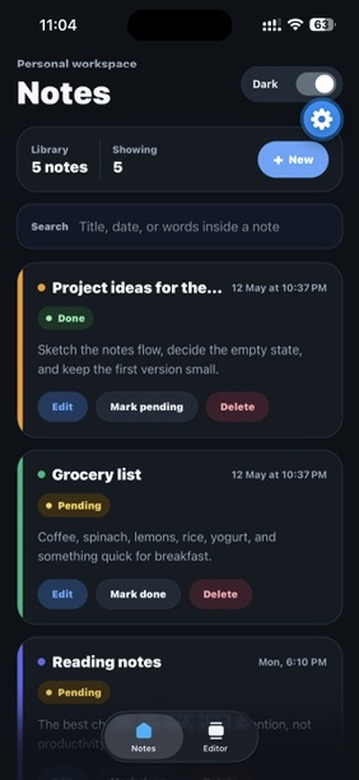
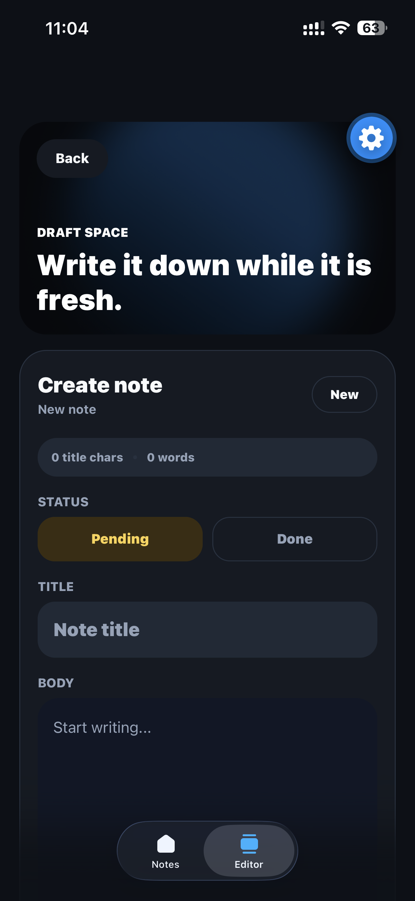

# Notes App UI

A modern notes app interface built with React Native and Expo SDK 55. The app focuses on clean mobile UI, responsive layouts, theme handling, note editing, and simple note status management.

## Preview

| Notes Listing | Note Editor |
| --- | --- |
|  |  |

## Features

- Scrollable notes listing screen built with `FlatList`
- Search notes by title, body, date, or status
- Create, update, and delete notes
- Mark notes as `Pending` or `Done`
- Editor screen for writing long-form notes
- Keyboard-aware editor layout using `KeyboardAvoidingView`
- Dark/light theme handling with `useColorScheme()`
- Manual theme toggle with a smooth animated transition
- Responsive layout support using `useWindowDimensions()`
- Custom app-opening splash animation
- Modern cards, status pills, editor counters, and action states

## Screens

### Notes Listing Screen

The listing screen includes:

- App header with theme toggle
- Summary panel for library count and visible notes
- Search bar
- Note cards with title, timestamp, preview, status, edit action, status toggle, and delete action
- Responsive one-column phone layout and two-column tablet/web layout

### Note Editor Screen

The editor screen includes:

- Image-backed header section
- Back button
- Create/update mode
- Title input
- Multiline body input
- Pending/done status selector
- Character and word counters
- Save, update, delete, and back actions

## Tech Stack

- Expo SDK 55
- React Native 0.83
- React 19
- Expo Router
- TypeScript

## Components Used

- `FlatList`
- `TextInput`
- `Pressable`
- `Switch`
- `KeyboardAvoidingView`
- `ImageBackground`
- `SafeAreaView`
- `View`
- `Text`
- `Animated`

## Hooks Used

- `useColorScheme()`
- `useWindowDimensions()`
- `useState()`
- `useMemo()`
- `useEffect()`
- `useRef()`
- `useContext()`

## Styling

- All styles are written with `StyleSheet.create()`
- Uses `StyleSheet.compose()`
- Uses `StyleSheet.flatten()`
- Theme colors adapt for light and dark mode
- Layout adjusts for phones, tablets, and web widths

## Run Locally

Install dependencies:

```bash
npm install
```

Start the Expo project:

```bash
npx expo start
```

Run on web:

```bash
npx expo start --web
```

## Project Structure

```text
src/
  app/
    _layout.tsx
    index.tsx
    explore.tsx
  components/
    notes-splash-overlay.tsx
  context/
    notes-context.tsx
docs/
  screenshots/
    notes-list.svg
    note-editor.svg
```

## Notes

The app uses in-memory state for the assignment flow. Notes created, edited, deleted, or marked done/pending will reset when the app reloads.

## Submission

- Public GitHub repository link: Add your repository URL here
- Demo video link: Add your video URL here
